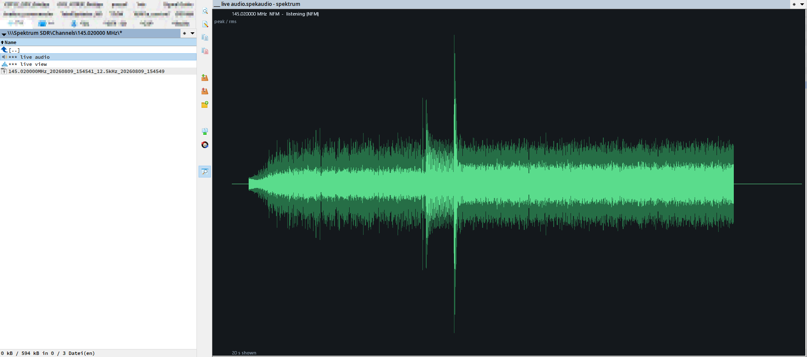
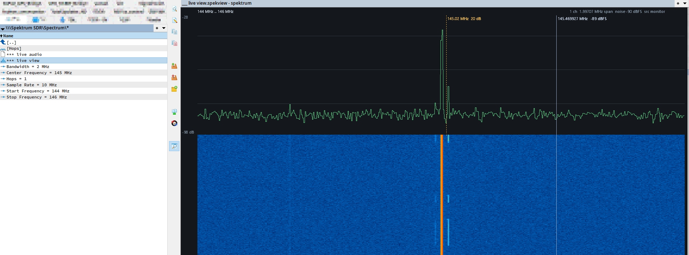
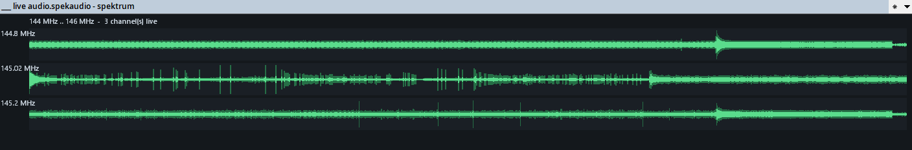
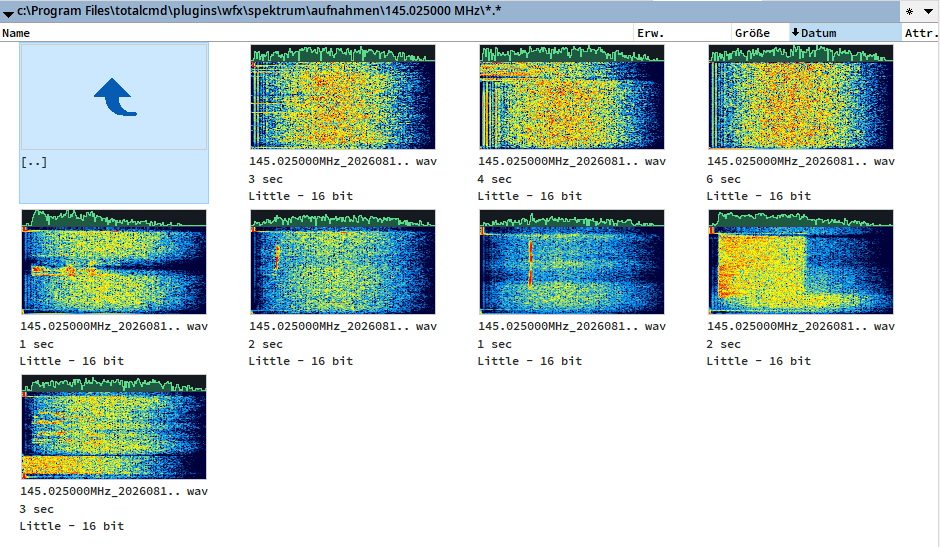

# wfx_spektrum

Total Commander file system plugin that turns an SDR receiver into a browsable
virtual file system: scan a frequency range, record every channel whose energy
rises above a configurable SNR threshold, and listen to a channel live.

Supported receivers: RTL-SDR (Nooelec and other RTL2832U sticks) and HackRF.






## Status

Working today: the background engine with both backends (RTL-SDR and HackRF),
the wideband scanner, the demodulation chain (NFM/WFM/AM/LSB/USB) with audio
recording to WAV, optional raw IF recording, live listening — to one channel
or to every active channel at once, without stopping a running scan — the
live spectrum and waterfall in Lister, thumbnails for recordings, and the
Total Commander plugin itself: browse the virtual tree, edit every setting,
start and stop a scan, and watch detected channels appear as folders.

## Receivers

**RTL-SDR** — one gain figure, `Gain`, with `-1` meaning the stick's own
automatic control. Sample rate typically 2.048 or 2.4 MS/s.

**HackRF** — gain is three separate stages, and they are not
interchangeable:

| Setting | Range | What it does |
|---|---|---|
| `HackRF LNA Gain` | 0…40 dB, 8 dB steps | RF stage ahead of the mixer. This is the one that decides whether a weak signal gets out of the noise. |
| `HackRF VGA Gain` | 0…62 dB, 2 dB steps | Baseband stage after the mixer. Moves signal *and* noise together, so it sets where the floor lands rather than the signal-to-noise ratio. |
| `HackRF Front-End Amp` | on / off | The extra 14 dB amplifier. Leave it off unless the band is genuinely quiet — it overloads easily. |
| `HackRF Bias Tee` | on / off | 3.3 V on the antenna port for an active antenna. |

The hardware refuses anything off those step grids, so a value is rounded to
the nearest step before it is sent. `Gain` still works for a HackRF: `-1`
means "use the three settings above", and any other value is distributed —
the RF stage first, because that is the stage that buys signal-to-noise, then
the baseband stage with the remainder.

The monitor session that feeds a live view **tunes a quarter of the sample
rate beside** the frequency being looked at, the same trick live audio uses.
Tuning straight onto a channel would put the signal exactly where a
direct-conversion receiver has its own offset — and where the DC removal
below then takes it out, leaving a flat line where the signal should be.

**The DC offset is removed in software.** A direct-conversion receiver puts
its own local-oscillator leakage and mixer offset exactly at the tuned
frequency — a fat spike in the middle of every spectrum, and a hum in
anything demodulated near the centre. The HackRF has no hardware correction
for it, so every session subtracts a running mean of I and Q (corner 500 Hz,
one instance per stream). It tracks the offset as it drifts with temperature
and gain instead of assuming a fixed figure. An RTL-SDR corrects its own and
is left alone.

Two HackRF specifics worth knowing. It **cannot sample below 2 MS/s**, so a
`Sample Rate` under that is refused with a message rather than silently
changed — a rate that is not what the DSP thinks it is would corrupt every
frequency computed from it. And it has **no frequency correction**: leave
`Frequency Correction` at 0, or the engine reports it rather than ignoring
it.

The command line reaches a HackRF too, which is how the backend gets tested
without Total Commander:

```bash
bin\spektrum_engine64.exe --scan --sdr=hackrf --start=87.5M --stop=108M --rate=8M --lna=40 --vga=50 --amp
```

`--sdr`, `--serial`, `--lna`, `--vga`, `--amp` and `--bias` work for both
`--scan` and `--live`. A command-line listen does not record unless `--record`
is given — the recording folder belongs to scans.

Internally the HackRF has no synchronous read at all — libhackrf delivers USB
transfers to a callback. The callback writes into a lock-free ring and the
engine's synchronous reads drain it. Streaming stays running across retunes;
the buffered samples are dropped on each retune because they belong to the
old frequency.

## Live view (spectrum and waterfall in Lister)

```
Spectrum\
  *** live view.spekview     the whole scan range

Channels\<frequency>\
  *** live view.spekview     just that channel
  *** live audio.spekaudio   just that channel, and it starts listening
```

The two extensions are deliberately different. With one shared extension the
entries are indistinguishable to Total Commander and to the eye, and there is
no way to tell from the panel which one will make sound.

The `Spectrum` folder's audio entry is the whole range at once: every channel
above `SNR Threshold` gets its own demodulator, they are mixed into one audio
stream so you hear all of them, and each one draws its own envelope strip,
stacked one below another in frequency order and 50 px tall.

The strips share a single time axis. Every lane publishes once per block,
silent ones included, so a burst on one channel lines up with what the others
were doing at that moment. With more channels than fit, the strips shrink
rather than being cut off. Mixing is a sum with a limiter, not an average —
an average would duck everything as soon as a second channel opened, which
sounds like the radio fading out.

The limit is the tuner, not the number of channels: the receiver has one RF
window, and anything outside it is not in the sample stream at all. Inside
that window there can be as many channels as `Max Parallel Channels` allows.
So this covers exactly one hop — if the range needs more, the middle hop is
used and the rest is out of reach. Raise `Sample Rate` until the range fits
in one window and nothing is.

**Everything in the Lister views is scaled by the window's DPI**, read per
monitor via `GetDpiForWindow` where Windows has it and from the desktop DPI
otherwise, and re-read on every paint so dragging the window to a differently
scaled monitor is handled. The 50 px lane height, the margins, the axis and
the font all follow it.

A **channel** view shows the channel, not the whole receiver window — 256 kHz
for WFM, 12.5 kHz for NFM, plus some margin so the shoulders stay visible.

The narrowing happens **in the engine, before the periodogram is reduced to
the number of points the viewer can draw**. That order is the whole point.
Reducing a 2 MHz window to 2048 points first gives 1 kHz per point, and a
12.5 kHz channel cropped out of that has about twenty of them — a staircase.
Cropping first spends all 2048 points on the channel, so it gets the FFT's
own resolution (125 Hz at NFft 16384), and the reply carries the edges its
bins really cover so the axis and the cursor cannot drift from the data.

F3 on either opens a live spectrum with a waterfall below it, in Total
Commander's own Lister.

**The same DLL is both the file system plugin and the Lister plugin**, which
is why it ships under two names: `spektrum.wfx64` and `spektrum.wlx64` are
byte-identical. Register both — *Plugins → File system plugins* for the WFX,
*Plugins → Lister plugins* for the WLX. Without the second registration the
live entries open in the internal text viewer and show the ticket instead.

That ticket is the mechanism: Total Commander copies a virtual file to a
temp file before handing it to a Lister plugin, so the virtual file cannot
*be* the live view. What gets written is a short description — mode, centre
frequency, span, modulation — and the Lister side acts on it and talks to
the engine itself.

**Detected channels are marked in the trace.** Every frame carries the
detections from its own analysis — the same SNR criterion the scan uses — and
the viewer draws a dotted vertical line with the frequency and SNR at each
one, plus a tick into the waterfall. The marks come from the frame itself
rather than from the accumulated channel list, so they always belong to the
trace they sit on; a mark outside the window currently on screen is simply not
drawn. Marks are held for 2.5 s after the engine last reported them and dim
after 0.7 s, because detections come and go with every frame and an unheld
mark would flicker at the poll rate. The header shows how many are live.

A mark sits on the **channel**, which for a modulated signal is not the same
column as the peak of the trace beside it — see *The channel is not the peak*
below before treating that gap as a bug.

With nothing else running, the monitor session started for the viewer detects
too — otherwise the one case where you are only looking at the spectrum would
be the one case with no marks.

**A frequency cursor follows the mouse.** Moving the pointer over the graph
or the waterfall draws a vertical line through both, labelled with the
frequency that column stands for and the level of the trace there. The
frequency comes from the range actually on screen, so in a channel view —
which is cropped to the channel — it reads the channel, not the receiver
window. The label flips to the left of the line near the right edge instead
of running off it.

The reading is rounded to a step the display can resolve — one pixel of a
20 MHz span is 22 kHz, and printing `97.57033 MHz` there would claim a
precision the cursor does not have. The step follows the zoom on the usual
1 / 2 / 5 ladder, so a channel view still reads down to the hertz.

**A second, horizontal line reads the level.** While the pointer is over the
graph itself, a dotted line runs across it at the pointer's height, labelled
with the level that height stands for. It is drawn from the inverse of the
mapping the curve itself uses, so the reading and the trace cannot disagree.

The two labels answer different questions on purpose: the one at the top
says how strong the *trace* is at this frequency, the one at the line says
what level the *pointer* is at. Together they measure a distance — park the
pointer on the noise floor and read straight off how far a carrier stands
out of it, instead of counting 20 dB grid lines.

There is no horizontal line over the waterfall. Height is time there, not
level, and a line across it would offer a measurement that does not exist.

Where the pointer is gets read during the paint rather than tracked through
mouse messages. That way a pointer that leaves the window, or a window that
ends up under another one, needs no special handling: if the cursor is not
over this window, no line is drawn. Mouse moves only trigger a repaint, so
the line follows the pointer instead of waiting for the next frame.

The view never fights for the receiver. Whichever session already owns it
publishes its periodogram, and the viewer takes the newest frame:

| what is running | what the view shows |
|---|---|
| a scan, sweeping | the sweep as it hops, `src scan` |
| a scan, dwelling on a hop | that hop, ~5 frames/s, `src dwell` |
| listening through a running scan | still the dwell, `src dwell` — the scan owns the radio |
| live audio | the band being demodulated, `src live` |
| every channel at once | the whole hop, `src multi` |
| nothing | a monitor session started for the viewer, `src monitor` |

The monitor stops itself a few seconds after the viewer stops asking, so a
forgotten Lister window does not hold a receiver.

`*** live audio` additionally starts live listening at that frequency, and
stops it again when the Lister window closes. The frequency axis is centred
on the tuner, not on the listened frequency — with offset tuning those are
deliberately not the same, and the display shows what the receiver sees.

## Live audio

`Live Audio.cmd` asks for a frequency and a modulation and starts playing
immediately through the default sound device. **The frequency is deliberately
not restricted to the configured scan range** — this is the way to point the
receiver at something on purpose. The only limit is what the tuner can
physically reach; anything outside that is refused with the device's actual
range in the message.

While playing, the entry becomes `Stop Live Audio.cmd`, and `Status.txt`
shows the frequency, the mode and the tuner centre.

The dialog opens on the frequency you last listened to. A running session
wins — retuning starts from where you are now; otherwise the frequency comes
from `LastLiveHz` in the INI, which survives restarts of Total Commander and
of the engine. Only a plugin that has never played anything falls back to the
middle of the scan range. Just the frequency is remembered: the modulation
still follows the running session, or the configured `Modulation` when there
is none. The value is written only when a session actually started, so a
frequency the tuner refused is not offered again.

**Listening to a channel does not stop the scan.** A channel inside the
scanned range is already in the samples the dwell is reading, so it is
demodulated and played straight from there — no handover, and everything
else keeps being detected and recorded. With a single hop that is gap-free.
With several hops the channel is audible while the dwell sits on the hop
that covers it and silent in between: the receiver is genuinely elsewhere
then, and no arrangement of software changes that.

Only two cases still take the radio from a scan, because they need a tuning
the scan does not provide: a frequency **outside** the scanned range, and
the Spectrum folder's "listen to everything at once". Starting a scan
likewise stops those. Both directions happen without asking, because both
are explicit, immediate requests.

The receiver is tuned a quarter of the sample rate **off** the wanted
frequency and the demodulator shifts the rest of the way. RTL-SDR sticks
have a large spurious spike at DC, and tuning straight onto a signal parks it
right on top of that spike. `Status.txt` shows the offset centre for that
reason.

Playback goes through `waveOut` rather than WASAPI: no COM, no extra units,
and the latency is irrelevant for listening to a radio channel.

From the command line, without Total Commander:

```bash
bin\spektrum_engine64.exe --live --freq=145.5M --mod=NFM
```

Add `--wav=out.wav` to also write what is being played, which is the only
way to inspect the live path after the fact.

The squelch runs on the same detector the scan uses, so the same knobs reach
it here: `--snr`, `--nfft`, `--avg`, `--grid` and `--hang`. Without them a
squelch test silently measures the default threshold instead of the one asked
for — which it used to, and which cost an afternoon. `--record` writes what is
heard, under the same rules a scan follows.

```bash
bin\spektrum_engine64.exe --live --sdr=hackrf --freq=105.5M --mod=WFM --snr=5 --seconds=12 --record --log
```

## Recording

Between start and stop, every channel whose energy rises `SNR Threshold` dB
above the noise floor is recorded to `<Recording Folder>\<frequency>\` as
16-bit mono at `Audio Sample Rate`. The folder name matches the virtual
`Channels` entry exactly, so the two line up without translation. A channel
can produce many files over a session; each transmission is its own file.

The file name carries everything the recording knows about itself, so it
stays identifiable after being copied out:

```
145.500000MHz_20260809_141140_12.5kHz_20260809_141143.wav
   frequency     start        bandwidth      stop
```

The stop time cannot be known when the file is opened, so a recording in
progress ends after its bandwidth and is renamed on close. Both dates are
written in full — a scanner left running overnight produces recordings that
cross midnight. IF recordings follow the same shape, with the sample rate as
the bandwidth: `IF_<frequency>_<start>_<rate>_<stop>.wav`.

Recordings shorter than `Min Recording Length` are deleted on close, because
a folder full of half-second squelch blips is worse than nothing.

### Listening records too

Recording is not tied to a scan. Whenever the engine produces audio it also
writes it, as long as `Audio Recording` is on:

- a **scan**, from the dwell, one file per transmission per channel
- **live audio** on one frequency
- **live audio on the Spectrum folder**, one file per channel it is hearing

All three land in the same `<Recording Folder>\<frequency>\` and follow the
same squelch, hang time and minimum length. It matters most in the two cases
that *do* take the radio from a scan — a frequency outside the scanned range,
and listening to everything at once — because without it those would be the
situations that produce nothing.

The live sessions hand the recorder the audio they already demodulated for
the speaker rather than a second demodulator over the same samples, and they
hand it the **unmuted** stream: what the squelch does to the loudspeaker is
the speaker's business, and the recorder decides for itself what the hang
time swallows.

### Squelch and hang time

The squelch decision is not made from the audio level but from the same FFT
detection that found the channel: a channel is open exactly while its SNR is
above `SNR Threshold`. When the signal drops, `Squelch Hang Time` (default
2000 ms) has to pass before the channel is considered gone — a transmission
with a pause in it stays *one* recording instead of being cut into pieces.

Audio is written continuously except for a rolling tail exactly one hang time
long, which stays provisional. If the signal returns the tail is committed,
gap and all; if the hang time expires it is dropped, so a recording never ends
with two seconds of squelch noise. A recorder closed for any other reason —
the dwell ending while the signal is still there — keeps its tail, because
that tail is audio.

The tail is sized by *time*, deliberately, not by "everything since the last
detection". The detector confirms a channel only every 200 ms, so holding
back everything since the last confirmation throws away a slice of every
transmission — and a transmission barely above `Min Recording Length` loses
enough to be deleted as too short. `--selftest-record` covers exactly that:
it runs the real dwell and recorder against the synthetic device with the
tone switched off partway through, and checks a file survives.

**Live audio uses the same rule.** Below the threshold the output is muted
(silence, not a stopped stream, so there is no click and the envelope view
keeps scrolling) and the AGC gain is frozen — otherwise it would spend the
silence winding up on noise and blast the first moment of the returning
signal. Detection there is restricted to the tuned channel's own bandwidth,
so a strong neighbour cannot hold the squelch open.

### Thumbnails

In Total Commander's thumbnail view a recording shows what is *in* it:

- the lower 85 % is a waterfall of up to the first 30 seconds, time running
  from the bottom (start of the recording) upwards
- the top 15 % is the spectrum at the middle of that section, as a curve

Both share one frequency axis, and which axis that is depends on what the
file actually contains:

- An **IF recording** is complex baseband, so it gets a two-sided radio axis
  with the recorded centre frequency in the middle: a signal below the
  centre really does appear left of it.
- An **audio recording** gets a one-sided **audio** axis, 0 up to a fifth
  beyond what the mode carries — 6 kHz for NFM, 18 kHz for WFM.

That distinction was got wrong at first, and the mistake is worth recording.
Audio recordings used to be drawn two-sided as well, on the argument that a
demodulated channel's 0 Hz *is* the channel's centre frequency. That holds
for SSB, where demodulation really is a frequency shift, and roughly for AM.
**It is false for FM**, where the discriminator maps frequency onto
amplitude: the audio spectrum bears no relation to the radio spectrum. The
result looked like an RF picture and was not one. Worse, it was uninformative
in three separate ways — its width was the demodulator's own audio filter and
therefore identical for every recording of a given mode; its symmetry was an
artifact of the input being real-valued; and the transmission itself was
squeezed into a fifth of the frame with mirrored emptiness either side.

The mode is not stored in the WAV, so the span comes from the channel width
the recorder puts in the file name (`..._12.5kHz_...` is NFM, `..._256kHz_...`
is WFM). A WAV this plugin did not write has no such token and is drawn
across its whole one-sided band, which is the right answer when nothing is
known about the content.

Nothing is read whole — a 30 s IF recording at 2.048 MS/s is a quarter of a
gigabyte, and the renderer seeks to the few kilobytes each transform needs. A
60 s file renders in about 40 ms.

By default only this plugin's own recordings get one, recognised by the name
the recorder gives them (`<frequency>MHz_<date>_<time>.wav`) or by the `auxi`
chunk in an IF file. Set `Thumbnails For All WAV` to `1` to extend it to every
WAV file. Foreign files are left to whatever showed them before.

Thumbnails come from two different exports, because Total Commander asks two
different plugins depending on where the file is:

- **On disk** it asks the *Lister* plugin, `ListGetPreviewBitmapW`. The
  detect string lists `WAV` only so TC offers us those files at all;
  `ListLoadW` returns 0 for anything that is not a live-view ticket, so F3 on
  a WAV still opens whatever it opened before.
- **Inside the plugin's own panel** — `Channels\`, `Archive\` — it asks the
  *file system* plugin, `FsGetPreviewBitmapW`, because a virtual path is
  nothing Windows could open. That one resolves the virtual path to the
  recording on disk exactly the way F5 does, and renders through the same
  code. Both routes produce a byte-identical bitmap.

The panel route deliberately does not set `FS_BITMAP_CACHE`: a recording that
is still being written changes under TC, and a cached first impression of it
would stick.

The bitmap is a 32-bit DIB section, and every pixel is written with an
**opaque alpha byte**. Leaving alpha at zero costs nothing on the Lister
route — TC blits those — but the plugin panel composites the bitmap, and a
zero alpha channel makes the whole thumbnail render solid black.

### Channels versus Archive

Two views of the same recordings, and the difference matters:

Starting a scan clears the channel list, so `Channels\` always shows the
current run and not a pile of leftovers from earlier ones. It is cleared only
once the scan really started — a start that fails for want of a receiver
leaves the previous run's channels where they were. Stopping a scan does
*not* clear anything: the channels stay listed, they just stop being marked
as transmitting, until the engine itself exits on its idle timeout.

- **`Channels\`** is what the *running scan* knows about. It comes from the
  engine's channel list, carries the live spectrum and audio entries, and
  shows whether a channel is transmitting right now. With no engine running
  it is empty — there is no current scan to report on.
- **`Archive\`** is the recording folder read straight off disk. It needs no
  engine, survives every restart, and keeps showing sessions from days ago.
  Its subfolders are exactly the folders on disk, so the `IF` folder with
  baseband recordings appears there too.

Use `Channels` while scanning, `Archive` to get at what was recorded.

The recordings behave like ordinary files: **F5 copies** them out (with a
progress bar, and Total Commander's cancel button works), **F8 deletes**
them, and deleting a whole channel folder removes it from disk once it is
empty. A channel folder that has no recordings yet exists only virtually, so
removing it succeeds without doing anything.

## What happens when the plugin is unloaded

`Stop Engine On Unload` (default `1`) quits the engine when Total Commander
unloads the plugin DLL. Be aware what that trades away: the engine is a
separate process **precisely** so a scan survives the DLL being unloaded, and
this throws that away — set it to `0` if a scan should outlive the plugin.

The request runs under the Windows loader lock, so it is one short connect
and one write with no reply and no retry; anything that could block there
would hang a closing Total Commander instead of closing it. The flag is read
from a variable rather than the INI for the same reason.

**Do not expect this to fire often.** Two things limit it, and both are
worth knowing before treating a surviving engine as a bug:

- Total Commander does not unload a file-system plugin every time you
  navigate out of it. In practice the DLL stays loaded for the life of the
  application, so the hook runs at exit and not before. It has been measured
  against `spektrum_probe`, which loads and unloads the same DLL for real:
  the engine logs `watchdog: QUIT received - exiting` and is gone.
- The whole budget is 20 ms. If the engine happens to be serving another
  request at that instant - and a Lister view polls several times a second -
  the connect fails and the QUIT is dropped, silently and deliberately.

What actually guarantees no engine outlives Total Commander is not this flag
but the client watchdog described above: every request carries the client's
process id, and the engine waits on that process.

## What happens when Total Commander closes

The engine is a separate process on purpose, so a scan survives the plugin
DLL being unloaded when you navigate away. It must not, however, outlive the
application that started it — audio still coming out of the speakers with no
window in sight is the worst possible behaviour.

So every request that starts something carries the client's process id, and
the engine waits on that process:

- **Live audio and the spectrum monitor stop at once** when the client ends.
  They exist only to serve someone listening or watching.
- **A scan gets a ten second grace period**, then the engine exits. A client
  that comes straight back finds its scan still running; one that does not
  leaves nothing behind.

This covers Total Commander crashing too, which no amount of tidy shutdown
code inside the DLL could.

### An idle engine must not hold the receiver

A session that ends **by itself** — the monitor timing out after its Lister
window was closed, a live session hitting a device error — used to leave its
object behind until the next request that happened to want the radio. The
status said `Running=0 Live=0`, truthfully, while the USB device was still
open, because the object still held its reference. Everything started
afterwards then failed to open the receiver, or opened it and competed for
the same stream — which sounds and looks like stuttering, from a process that
reports it is doing nothing.

Finished sessions are now collected every two seconds by the watchdog, and
again at the start of every request. The log says which one went:

```
monitor: no viewer for 4000 ms - stopping
reaped: the monitor had stopped itself - receiver released
```

`STATUS` reports `Monitor=0/1` alongside `Running` and `Live` for the same
reason: a monitor session owns the receiver exactly as much as a scan does,
and a status that mentioned neither made a held device look like a free one.

If something ever behaves as though the receiver were busy, `--list` shows
whether it can be enumerated and `STATUS` shows what the engine thinks it is
doing; a stale engine process is the first thing to rule out.

### The recording folder may be relative

`Recording Folder` accepts an absolute path, a UNC path, or a **relative**
one. A relative path is resolved against the folder the plugin and engine
live in — deliberately *not* against the process working directory. Leaving
it empty means `recordings` beside them.

That distinction matters: the plugin happens to start the engine with its own
folder as the working directory, so relying on the working directory would
appear to work and then quietly point somewhere else the moment the engine is
started by hand from a console. `spektrum_engine --list` prints the resolved
folder so there is never any doubt.

## Choosing a receiver

`Config\Device` lists everything connected and lets you pick one. It shows
what is selected, not a number to decode:

```
Device = 77991244 - Generic RTL2832U OEM
```

What gets stored is the **serial number**, because USB indices shuffle
whenever a stick is unplugged or another one is added — an index is a poor
way to say "that receiver". The index is still kept in the INI as
`DeviceIndex` and used when no serial is stored (the single-device case, and
sticks whose serial cannot be read), but it is not shown: it is a consequence
of picking a receiver, not a separate decision, and showing both invited
editing one without the other.

Clearing the entry falls back to the index, displayed as
`first device (index 0)`.

If the configured id is not present, the engine says so and lists what *is*
connected, instead of silently recording from the wrong stick.

HackRF units are enumerated by the same code and selected the same way; see
the receiver section above for the gain stages they bring with them.

### Sweeping versus recording

A receiver tuned to 145 MHz cannot record a channel at 400 MHz, so the two
activities alternate: a fast sweep finds what is on the air, then the radio
dwells on each hop that had activity and demodulates **every channel inside
that hop in parallel** (up to `Max Parallel Channels`). While dwelling, the
detector keeps running on the same stream, so channels appearing and
disappearing mid-dwell are picked up without interrupting anything.

`Max Dwell` caps how long one hop may hold the radio before the sweep
continues. **When the configured range fits in a single hop this limit is
ignored and the dwell runs indefinitely** — that is the case where recording
is genuinely gap-free, and it is worth setting the range up that way if
continuous audio matters more than coverage.

### IF recording

Setting `IF Recording` to 1 additionally writes the raw baseband of each
dwell to `<Recording Folder>\IF\` as a 16-bit stereo WAV (I left, Q right) at
the full sample rate, with an `auxi` chunk carrying the centre frequency and
the start/stop time. Such a file can be re-tuned and re-demodulated later
with different settings, which the audio recordings cannot.

It costs about **8 MB per second** at 2 MS/s. Watch the disk.

## Installing

Copy `spektrum.wfx`, `spektrum.wfx64`, `spektrum.wlx`, `spektrum.wlx64`,
`spektrum_engine32.exe`, `spektrum_engine64.exe` and `pluginst.inf` into one
folder, then use Total Commander's *Configuration → Options → Plugins → File
system plugins → Configure*, and *Lister plugins → Configure* for the `.wlx`
pair. The engine executables must sit next to the DLL — that is where the
plugin looks for them.

The `.wlx` files are byte-identical copies of the `.wfx` ones; they exist
under a second name only because Total Commander's install dialog filters by
extension. Without the Lister registration the live entries open in the
internal text viewer and show their ticket.

Settings live in `wfx_spektrum.ini` next to the DLL, falling back to
`%APPDATA%\wfx_spektrum\` when the plugin folder is read-only.

## Using it

```
\
├─ Config\           one entry per setting; Enter opens an input box
├─ Spectrum\         what the sweep covers, and the hop plan
│   ├─ Hops\         one entry per tuning step
│   ├─ Center Frequency = 98 MHz
│   ├─ Bandwidth = 20 MHz
│   ├─ Start Frequency = 88 MHz
│   ├─ Stop Frequency = 108 MHz
│   ├─ Sample Rate = 2.048 MHz
│   └─ Hops = 12
├─ Channels\         one folder per channel the RUNNING scan knows about
├─ Archive\          everything on disk, no engine required
├─ Start Scan.cmd    replaced by "Stop Scan.cmd" while a scan runs
├─ Live Audio.cmd    replaced by "Stop Live Audio.cmd" while playing
└─ Status.txt        F3 shows engine state, settings and the channel table
```

Start and stop are one toggle rather than two entries of which one is always
a no-op: whichever command is visible is the one that will actually do
something, so the root folder doubles as a scan-running indicator. Executing
either one re-reads the folder, so the entry flips immediately.

The **Spectrum** folder is the second way of expressing the scan range.
Centre frequency and bandwidth are not stored anywhere — they are computed
from start/stop, and editing either one recomputes the pair: changing the
centre slides the range and keeps its width, changing the bandwidth widens
or narrows it around the same centre. Start and stop stay editable directly,
so both mental models work.

`Hops\` shows what the sweep will actually do. A receiver can only look at
`Sample Rate` worth of spectrum at a time, so a wider range is covered by
retuning. Each entry gives that step's centre plus the band it contributes,
which is the usable window after the tuner's filter roll-off is discarded
and clamped to the requested range — hence the first and last hop being
narrower than the rest. The plan is computed by the same code the scanner
uses, so the display cannot drift away from what is really scanned.

### Icons

Every entry carries its own icon, and channel folders use it to show state:
a lively waveform means the channel is transmitting right now, a shallow one
means it has gone quiet. Together with the timestamps that makes a sorted
panel readable at a glance.

The icons are generated, not checked in as hand-drawn binaries:

```bash
powershell -ExecutionPolicy Bypass -File tools\make_icons.ps1
```

That writes the `.ico` files under `plugin/icons/` and, in the same pass,
`plugin/spektrum_icons.res`, which the DLL embeds. Resource ids in the
script and in `plugin/uIcons.pas` must stay in sync. Re-run it only when an
icon changes; the committed `.res` is what the build consumes.

### Channel folders and their timestamps

Each detected channel becomes a folder, and its date carries information:

- A channel that is **still transmitting** — present in the most recently
  completed sweep — shows the time of the current refresh, so it visibly
  keeps up with the clock.
- A channel that has **gone quiet** keeps the time it was last heard, which
  is when it stopped.
- After `Stop Scan.cmd` nothing is active any more, so every folder shows
  when that channel stopped.

Sorting the panel by date therefore puts whatever is on the air right now at
the top. `Status.txt` spells the same thing out in an `active`/`stopped`
column.

### Automatic refresh

`Config\Channel Refresh` (seconds, 0 = off, default 5) makes the panel
re-read itself while a scan runs, so new channels appear and the timestamps
of live ones keep moving without pressing Ctrl+R.

This only happens while the `Channels` folder is the one being displayed —
listing any other folder in the plugin disarms it immediately, as does
leaving the plugin or stopping the scan. A plugin cannot refresh a panel
directly, so this asks Total Commander to do it through TC's own remote
command interface.

One limitation worth knowing: the refresh acts on TC's *active* panel. If
you switch panels without re-entering a plugin folder, the plugin does not
find out, and the refresh will reread whatever is now in front. Set the
interval to 0 if that gets in the way.

The scan keeps running when you navigate away from the plugin — that is the
whole point of the engine being a separate process. `Stop Scan.cmd` ends it;
otherwise the engine shuts itself down once it has been idle for ten minutes
with no scan running.

## Architecture

The plugin is split into two processes on purpose:

- **`spektrum.wfx` / `spektrum.wfx64`** — thin DLL loaded by Total Commander.
  Virtual file system, configuration dialogs, IPC client. Nothing that can
  block, because Total Commander calls plugin callbacks on its UI thread.
- **`spektrum_engine32.exe` / `spektrum_engine64.exe`** — the worker. Owns the
  USB device, the DSP and the audio output.

This split means a running scan survives Total Commander unloading the plugin
DLL when you navigate away, a crash in a USB driver cannot take the file
manager down with it, and a 32-bit Total Commander can drive the 64-bit
vendor DLLs.

## Required external libraries

Neither driver library is bundled — both are third-party and separately
licensed. Place the DLL next to `spektrum_engine*.exe` (the engine looks
there first) or anywhere on the `PATH`.

**The plugin and the engine themselves need nothing.** Their whole import
list is Windows: `kernel32`, `user32`, `oleaut32`, `winmm` for the engine,
`kernel32`, `user32`, `gdi32`, `oleaut32` for the DLL. No C runtime, no
redistributable — that is what the Free Pascal build buys.

Everything below is what the *driver* libraries drag in. Only the first
column is loaded by name at run time; the rest are ordinary imports that
Windows resolves when that library loads, and a missing one shows up as
"`hackrf.dll` not found" even though the file is sitting right there.

| Needed for | Library | Pulls in |
|---|---|---|
| RTL-SDR | `rtlsdr.dll` or `librtlsdr.dll` | depends on the build — see below |
| HackRF | `hackrf.dll` or `libhackrf.dll` | `libusb-1.0.dll`, `pthreadVC2.dll`, `VCRUNTIME140.dll` |

`VCRUNTIME140.dll` (with the `api-ms-win-crt-*` stubs beside it) comes from
the Visual C++ 2015-2022 redistributable and is on most machines already.
The other two have to come from somewhere, and "somewhere" is the trap: they
are frequently found by accident, in `System32` or on the `PATH` courtesy of
some other SDR program. That works until that program is uninstalled, and
then a HackRF stops being found for no visible reason. **Put them in the
plugin folder**, where they come first in the search order and belong to
this installation.

To check what a particular library actually wants, read the DLL names out of
it — they sit in the import table as plain text:

```bash
tr -c '[:print:]' '\n' < hackrf.dll | grep -i '\.dll$' | sort -fu
```

### RTL-SDR

Needs `rtlsdr.dll` (or `librtlsdr.dll`). Whether `libusb-1.0.dll` has to be
supplied separately **depends on which build you have**: the widely
circulated 337 KB build links it statically and imports nothing but
`kernel32`, while other builds expect it beside them. Run the command above
against your copy rather than guessing.

- Official Osmocom Windows builds:
  [ftp.osmocom.org/binaries/windows/rtl-sdr](https://ftp.osmocom.org/binaries/windows/rtl-sdr/)
- Actively maintained fork with newer tuner support:
  [github.com/librtlsdr/librtlsdr](https://github.com/librtlsdr/librtlsdr)

The stick also needs the WinUSB driver instead of the Windows DVB-T driver.
Install it with Zadig: [zadig.akeo.ie](https://zadig.akeo.ie/)

Match the architecture: `spektrum_engine64.exe` needs the 64-bit DLL.

### HackRF

Needs `hackrf.dll`, **and the two libraries it imports**: `libusb-1.0.dll`
and `pthreadVC2.dll`. All three ship together in the official release
archives, which is the reason to take them from the same archive rather than
collecting them from wherever they happen to exist:
[github.com/greatscottgadgets/hackrf/releases](https://github.com/greatscottgadgets/hackrf/releases)

It also needs the WinUSB driver — the same Zadig procedure as above.

Every entry point is resolved by name at load time, so a `hackrf.dll` that
is older than one of them loses that feature rather than failing to load.
The gain stages, the baseband filter and the bias tee are all optional in
that sense; only open, tune, sample rate and start/stop are required.

### One architecture per folder

The 32-bit and 64-bit driver libraries have identical names, so a single
folder can only hold one set of them. Installing both engines side by side
therefore works only as long as just one architecture's drivers are present:
`spektrum_engine32.exe` would find the 64-bit `hackrf.dll` first — it is in
its own folder, ahead of the `PATH` — and fail to load it. With a 64-bit
Total Commander, which is the normal case, this never comes up.

## Building

Lazarus is not on the `PATH`; use the full path to `lazbuild`. Both projects
must be built for both architectures, and the plugin additionally under its
Lister names — six artifacts in total, all landing in `bin/`.

```bash
lazbuild.exe --build-mode="Release 64" engine/spektrum_engine.lpi
```

```bash
lazbuild.exe --build-mode="Release 32" engine/spektrum_engine.lpi
```

```bash
lazbuild.exe --build-mode="Release 64" plugin/wfx_spektrum.lpi
```

```bash
lazbuild.exe --build-mode="Release 32" plugin/wfx_spektrum.lpi
```

The Lister variants are the same code under a different output name:

```bash
lazbuild.exe --build-mode="Lister 64" plugin/wfx_spektrum.lpi
```

```bash
lazbuild.exe --build-mode="Lister 32" plugin/wfx_spektrum.lpi
```

Units under `shared/` are outside both project directories, and lazbuild's
dependency tracking does not always notice when they change. If a warning or
error points at a line that no longer looks like that, delete
`engine/build/` and `plugin/build/` and build again.

The probe driver is built directly with fpc:

```bash
fpc -Twin64 -Px86_64 -MDelphi -O2 -FUprobe\build -obin\spektrum_probe.exe probe\spektrum_probe.lpr
```

Backslashes in `-o` on purpose: with forward slashes FPC drops the
extension and writes `bin\spektrum_probe`, which then will not run.

## Testing the engine from the command line

The engine is fully drivable without Total Commander, which is how the DSP
gets validated.

Verify the scan chain against synthetic signals — no hardware needed. It
plants three tones at known frequencies and checks that each is detected on
the correct grid channel:

```bash
bin\spektrum_engine64.exe --selftest
```

One of the three sits **deliberately off the raster**, 3.8 kHz above its
channel. With every tone on a grid point the snapped channel and the measured
peak are identical, and any code that confuses the two passes the test — which
is how they once got confused. The off-grid tone keeps them apart and checks
both: that the peak is measured to within a bin, and that it is filed under
the snapped channel.

The demodulators have their own check: it modulates a carrier with a known
audio tone, runs it through the full chain, and measures the frequency of
the audio that comes out. It also runs two cases with the demodulator tuned
*beside* the channel on purpose, which is what mistaking a peak for a carrier
does — those two lines are meant to look bad. Add `--spectrum` to print the
recovered audio spectrum, or `--noise=-200` to take the simulator's noise out
of the picture while diagnosing:

```bash
bin\spektrum_engine64.exe --selftest-demod
```

### When the recording does not match what live audio plays

Three causes, in the order they usually apply — and they are structural, not
bugs in the demodulator. `--selftest-record` measures the tone that actually
lands in the WAV (1002 Hz for a 1000 Hz test tone, RMS 0.176 — the same
figures the demodulator selftest produces), so the chain itself is ruled out.

1. **More than one hop.** Channels *inside* one RF window are all received at
   once; a channel outside it is not in the sample stream at all. With two
   hops the scan therefore alternates sweep / dwell / sweep / dwell, and a
   station on the other hop is simply not being received in between. Live
   audio sits on one tuning and never leaves. Fix: raise `Sample Rate` until
   the whole range fits in a single hop — the `Spectrum` folder shows the
   hop count.
2. **The DC spike.** Live audio tunes a quarter of the sample rate *off* the
   wanted frequency for exactly this reason. A dwell cannot: it has to sit on
   the hop centre to cover the whole hop, so a channel near that centre gets
   the receiver's DC spike inside its passband. Moving the range so the
   station of interest is not near a hop centre avoids it.
3. **The loop not keeping up.** Demodulating many channels plus the detector
   can take longer than the block just read, and `rtlsdr_read_sync` drops the
   difference without reporting it. Every dwell now logs whether it kept up:

   ```
   dwell: real time ok - 9.83 s of samples in 9.90 s (99 %)
   dwell: NOT keeping up - 6.10 s of samples in 9.90 s (62 %), the receiver dropped the rest
   ```

   If it says NOT keeping up, lower `Max Parallel Channels`, lower `FFT Size`
   (note that a value which is not a power of two is rounded **up**), or
   raise `SNR Threshold` so fewer channels open at once.

The recording chain has one too. It runs the real dwell loop and the real
recorders against the synthetic device and checks that a WAV comes out that
covers the transmission. It empties its own output folder first — it counts
the files in a channel folder, so a leftover from the previous run used to
fail a perfectly good build, with a message that read like a recording bug. `--stop-after=N` takes the tone off the air after N
blocks, which is where squelch, hang time and the minimum-length rule
interact — a short transmission still has to produce a file:

```bash
bin\spektrum_engine64.exe --selftest-record --stop-after=80
```

List connected receivers:

```bash
bin\spektrum_engine64.exe --list
```

Scan the 2 m amateur band with a 12.5 kHz channel raster:

```bash
bin\spektrum_engine64.exe --scan --start=144M --stop=146M --grid=12500 --snr=12
```

Scan continuously until Ctrl+C:

```bash
bin\spektrum_engine64.exe --scan --start=88M --stop=108M --grid=100k --sweeps=0
```

`--help` lists every option. Detections are printed as tab separated lines:

```
HIT<TAB>channelHz<TAB>peakHz<TAB>snrDb<TAB>powerDb<TAB>noiseDb
```

Add `--log` to write `spektrum_engine.log` next to the executable (falling
back to `%TEMP%` if that directory is read-only).

## Testing the plugin without Total Commander

`spektrum_probe.exe` loads the built `.wfx64` and calls its exports directly:

```bash
bin\spektrum_probe.exe bin\spektrum.wfx64 tree
```

```bash
bin\spektrum_probe.exe bin\spektrum.wfx64 exec "\Start Scan.cmd"
```

```bash
bin\spektrum_probe.exe bin\spektrum.wfx64 status
```

`set "<configEntryPath>" <value>` answers the plugin's input request
automatically, so settings can be changed non-interactively:

```bash
bin\spektrum_probe.exe bin\spektrum.wfx64 set "\Config\Frequency Grid = 12.5 kHz" 25k
```

Extra values answer further prompts in order, which is how the two-step Live
Audio dialog gets driven:

```bash
bin\spektrum_probe.exe bin\spektrum.wfx64 set "\Live Audio.cmd" 145.5M NFM
```

## Protocol

Plugin and engine speak a line-based text protocol over the named pipe
`\\.\pipe\wfx_spektrum_v1`, which means it can be driven by hand while
debugging. A request is a command line, optional body lines, then a line
holding a single `.`; a reply is `OK` or `ERR <message>`, optional body
lines, then `.`. Body lines are UTF-8 and dot-stuffed.

## How detection works

Per hop the engine grabs `NFft * AvgSegments` samples, Welch-averages the
periodogram, and estimates the noise floor as the **median** of the usable
bins. The median is deliberate: a handful of strong carriers barely moves it,
whereas a mean would be dragged upward by exactly the signals being hunted,
raising the threshold and hiding weak ones.

Bins more than `--snr` dB above that floor are grouped into clusters, the peak
of each cluster is refined by parabolic interpolation, and the result is
snapped to the channel raster. The raster is what gives a transmitter a stable
identity — without it, a peak wobbling by one bin between sweeps would create
a new folder every time.

Bins around DC are skipped because RTL-SDR sticks put a strong spike there,
and the outer edges of each hop are discarded because the tuner's IF filter
rolls off there.

### The channel is not the peak

Each detection carries two frequencies, and they are different things:

- the **peak**, interpolated from the strongest bins of that one periodogram
- the **channel**, that peak snapped to `Frequency Grid`

Everything the radio is pointed at uses the **channel**: the demodulator, the
recording folder, the mark drawn in the live view. Nothing is tuned to the
peak, and that is not an oversight.

The reason is that for anything modulated the peak is not the carrier. A
narrow FM signal's strongest bin sits wherever the deviation has pushed it at
that instant — for NFM that is ±3 kHz, wandering with the audio; for WFM it
wanders across the whole 200 kHz. Snapping to the raster is what averages
that out and gives a transmitter a stable identity, instead of a new folder
every sweep.

So a mark and the peak of the trace under it **can visibly disagree**, and
both are right: the trace says where the energy is right now, the mark says
which channel it belongs to. The two are read off the same frame, so nothing
is out of date.

What that costs, if the grid is wrong: `Frequency Grid` must match the band's
actual raster. With `GridHz=10000` on a 12.5 kHz band, a station on 145.025
is filed as 145.020, and the demodulator is then tuned 5 kHz off a 12.5 kHz
channel — the signal lands on the filter's flank, the AGC winds up on what is
left, and it sounds like hiss with a station somewhere behind it. The demod
selftest measures exactly that, on purpose:

```
# tuned beside the channel on purpose - these are SUPPOSED to be bad:
#      NFM  tone 1000 Hz -> 1002,0 Hz (err 2,0 Hz), rms 0,162
#      NFM  tone 1000 Hz -> 1998,0 Hz (err 998,0 Hz), rms 0,099
```

The first line is 2.5 kHz off the channel: still the right tone, a little
quieter. The second is 5 kHz off, and a 1000 Hz tone comes back as 1998 Hz.
That is not degradation, it is a different signal.

Both are printed without a verdict on purpose. They are measurements the
build reports, not checks it has to pass, and stamping `FAIL` on a case that
is *meant* to come out wrong puts a failure in the output of a healthy build.
